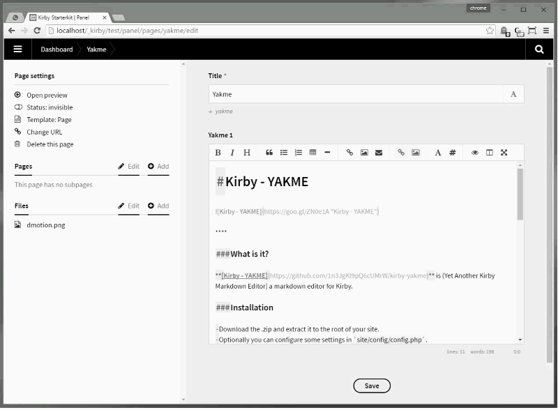
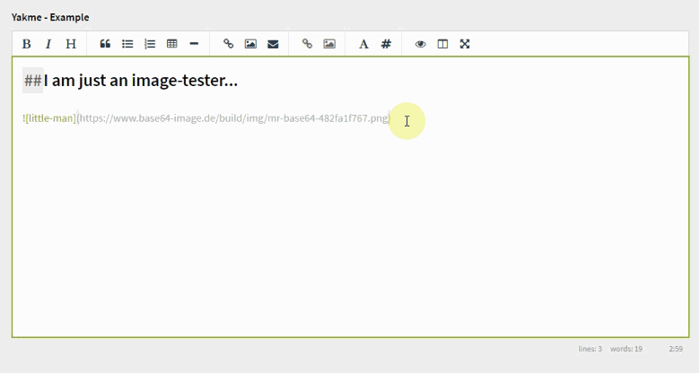
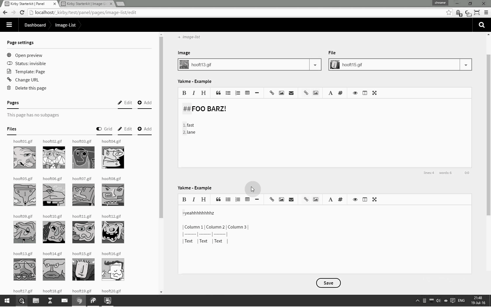

# [Kirby - YAKME](https://github.com/1n3JgKl9pQ6cUMrW/kirby-yakme)


****

#### Version 1.0.0 - 2016-07-13

- Initial Public Offering.

#### Version 1.1.5 - 2016-07-14

- Small adjustmens / fixes.
- Optional image-check for markdown-images.

#### Version 1.2.1 - 2016-07-25

- (Basic) support of image drag/drop from the assets-sidebar.
- Small adjustments / fixes.

#### Version 1.2.2 - 2016-07-26

- Kirby-tag insert fix (cursor position).
- Visual adjustments for the toolbar.

****

### What is it?

**[Kirby - YAKME](https://github.com/1n3JgKl9pQ6cUMrW/kirby-yakme)** (Yet Another Kirby Markdown Editor) is a markdown editor for Kirby.

It uses the **excellent** Simple MDE (editor) from **https://simplemde.com/** as it's core-engine.

More info about Kirby can be found at **http://getkirby.com**

More info about this plug-in can be found at **https://forum.getkirby.com/t/kirby-yakme-yet-another-kirby-markdown-editor/4677/13?u=1n3jgkl9pq6cumrw**

### Installation

- Download the .zip and extract it to the root of your site.
- Optionally you can configure some settings in `site/config/config.php`.

### Usage

A sample blueprint is included, as an introduction for the basic set-up.

```
title: Page
pages: true
files: true
fields:

  title:
    label: Title
    type:  text

  yakme_example:
    label: Yakme - Example
    type:  yakme
```

The fieldtype is ```yakme``` and it accepts no additional options (besides the one you can set in ```config.php``` and by setting the field-preferences ( _font_ / _wysiwyg_ ) for each field alone).

Once set, the field can be rendered like this;

```
<?php
    echo $page->yakme_example()->kirbytext();
?>
```

****

The field acts like a normal textarea, but with some extra's;

1. Live preview toggle (**eye icon**).
2. Hide markdown codes (**hashtag icon**).
3. Side by side editing (**column icon**).
4. Fixed font option (**font icon**).
5. Full support of all markdown codes ( http://www.markitdown.net/markdown ).

The fixed font is helpfull when creating tables or entering codes.

Every instance of a YAKME-field can have individual preferences;

1. Fixed font or default font.
2. Toggle (WYSIWYG) markdown codes.

These settings are saved to the local machine in the localstorage of your browser.

### Shortcuts

| **Shortcut** | **Action** |
| -------- | -------- | 
| Ctrl-' | Blockquote | 
| Ctrl-B | Bold | 
| Ctrl-D | Delete line | 
| Ctrl-E | Clear | 
| Ctrl-H | Heading - | 
| Ctrl-I | Italic | 
| Ctrl-K | Link | 
| Ctrl-L | Unordered List | 
| Ctrl-P | Preview | 
| Ctrl-Alt-C | Code | 
| Ctrl-Alt-I | Image | 
| Ctrl-Alt-L | Ordered List | 
| Shift-Ctrl-H | Heading + | 
| F9 | Sideview |
| F11 | Fullscreen |

> Mac users, please use `cmd` in stead of `ctrl`

### Config

By default, no `config` is needed. But you can set the height of the YAKME-field and perform an image-check;

```
c::set('yakme_height', 0);
```

This will set an "auto-height" for every field; the more the content, the larger the field.

```
c::set('yakme_height', 480);
```

This will set a "fixed-height" for every field; the size is in pixels and when the content becomes to large, a scrollbar will appear.

The settings defaults to 320px - so that's used when no settings are available.

****

```
c::set('yakme_images', 0);
```

Markdown-images will not be checked for validity, when rendered in the live-preview.

```
c::set('yakme_images', 1);
```
A check will be performed when previewing markdown-images. When an images does not exist, a error-sign is showed.

**Please note, Kirby image-tags can not be validated.**

###Known issues###

- Kirby-tags are supported, but not rendered in the live-preview (working on it...).
- Images are only rendered in the live-preview with a full url.
- Turning of the markdown codes (hastag icon) do not show if text is selected / can hide the cursor.

****



*Kirby YAKME - yet another kirby markdown editor.*



*Kirby YAKME - optional imagecheck enabled.*



*Kirby YAKME - asset drag and drop.*